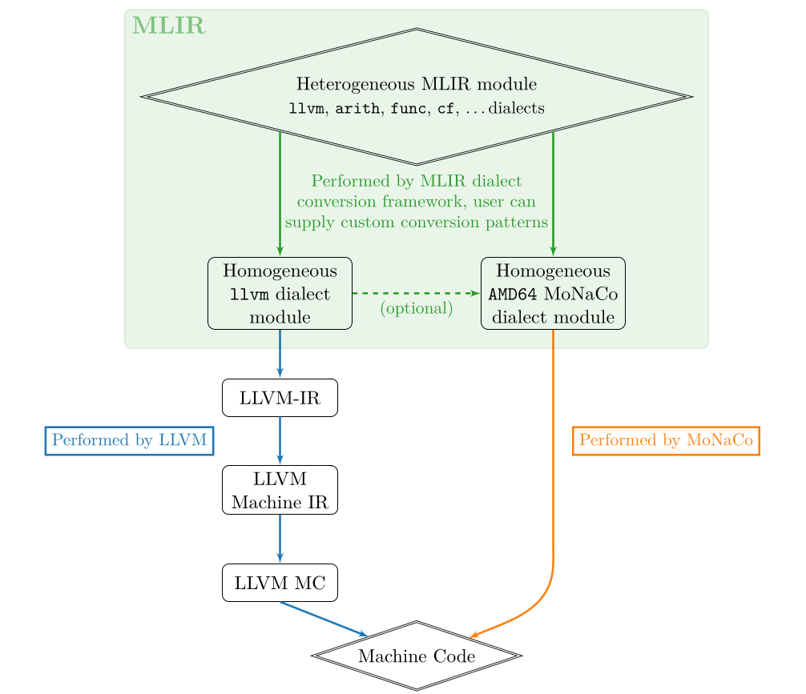

# MoNaCo: *M*LIR t*o* *Na*tive *Co*de generator
## Abstract
Compiler frameworks are used across applications and domains to speed up and simplify the development of compilers.
LLVM has long been the framework of choice for domains that aim to accelerate their workloads through the superior run-time performance of native machine code. The extensible MLIR framework has stepped in to provide more flexibility in modeling domain-specific semantics right in the IR, and allows users to leverage the potential of domain-specific transformations on a common platform.
However, MLIR currently lacks the capability to directly lower operations to machine code, which makes it hard to map domain-specific semantics straight to machine code for improved compile-time performance.

We present MoNaCo, a fast native code generator that directly converts MLIR to machine code, capable of letting users specify exact lowerings for performance critical operations. At the same time, MoNaCo explores the viability of MLIR for JIT compilation, where compile-times are critical.

MoNaCo outmatches MLIR's existing code generation path in terms of extensibility and outperforms it in terms of compile-time: across the MCF benchmark from SPEC CPU 2017 and the Dhrystone benchmark, MoNaCo's compilation times are about 48\% lower on average, while the resulting code is about 4 times slower on average. Our approach shows that MLIR is a viable option for efficient compilation, but several issues in the design and implementation of MLIR hold back its potential in JIT compilation.

## Approach



The existing path to generate machine code from an MLIR module lowers
the module to LLVM-IR and then reuses the LLVM code generator. This
lowering from MLIR to LLVM-IR is divided into two steps (see the start
of the left path
of the figure above): first, the heterogeneous MLIR module
consisting of ops from any dialect is converted to an MLIR module only
containing ops from the `llvm` dialect, which implements a subset of
features of the LLVM instruction set. As this conversion depends on the
semantics of the ops, conversions for ops of custom dialects need to be
specified by the user. Then, an existing converter translates the `llvm`
dialect MLIR module to an LLVM module. Differences between MLIR and LLVM
regarding metadata, function signatures, global values, and
[more](https://github.com/llvm/llvm-project/blob/a403d75be7add73f3e34032d73c81b8e1dcba3b9/mlir/lib/Target/LLVMIR/ModuleTranslation.cpp#L1384-L1393)
are handled here, and individual op translations provided by the op
definitions themselves are executed. Finally, the LLVM code generator
takes care of generating actual machine code. The entire process is
configurable through the LLVM C++ API.

Using LLVM as the code generation toolchain for an MLIR module has
several shortcomings:

1.  Speed: this process involves at least 60 passes over the program
    representation, translation between MLIR and LLVM data structures,
    as well as conversion between several LLVM-internal code
    representations. All of this leads to subpar compile-time
    performance.

2.  Loss of semantics: the precise modeling of op semantics via custom
    operations that MLIR enables, is lost in the translation to the
    fixed LLVM instruction set and only *then* to machine code. Besides
    the aforementioned domain-specific information, this also extends to
    certain low-level semantics, for instance information about
    arithmetic carries.

    In addition, certain transformations lose some of their
    effectiveness in the translation. For example, an MLIR module with
    eliminated common sub-expressions may produce an LLVM module that
    could benefit from running another common sub-expression elimination
    transformation. This results in unnecessary effort.

3.  Loss of analysis information: both MLIR and LLVM track information
    gained through their analyses in order to minimize recomputation of
    the same information. However, this information is not compatible
    between MLIR and LLVM pass infrastructures, thus any transformations
    run on the LLVM-IR generated from the MLIR module have to do their
    own analyses from scratch.

LLVM, however, has the following advantages for the user:

4.  Comfort: the user typically does not need to concern themselves with
    the specifics of code generation after lowering to the `llvm`
    dialect.

5.  Portability: lowerings to the `llvm` dialect suffice to be able to
    execute the code on any LLVM-supported platform.


We propose the ***M**LIR* *t**o*** ***Na**tive* ***Co**de generator* (MoNaCo),
which uses a different approach to address these shortcomings. MoNaCo
leverages MLIR's existing dialect conversion infrastructure to first
perform instruction selection, by converting the heterogeneous MLIR
module to a homogeneous module. This module only consists of functions
that are made up of MLIR ops from a target-specific dialect. Each op
from this dialect corresponds to exactly one opcode in the target ISA
encoding. We chose to implement the first MoNaCo back-end for the x86-64
(AMD64) architecture, so in the `AMD64` dialect, each op representing an
instruction corresponds to exactly one AMD64 opcode. In a second pass,
MoNaCo destructs SSA form, allocates hardware registers to each value,
emits a data section for global variables, and encodes the instructions
(see the right path
in the figure). It thus addresses the shortcomings
of the LLVM-based code generation process as follows:

1.  Speed: MoNaCo was designed with JIT compilation in mind and can emit
    JIT-execution-ready machine code in only two passes over the whole
    IR.

2.  Semantics: a MoNaCo user can provide conversions of their custom
    operations to the `AMD64` dialect, similar to the conversions needed
    to lower custom operations to the `llvm` dialect. As this lowering
    directly targets the ISA, the user can decide precisely how to
    bridge the semantic gap between their operations, and the target,
    without being constrained by the LLVM instruction set in between.

3.  Analyses: MLIR's pass infrastructure can be used to perform
    transformations such as instruction scheduling, or peephole
    optimizations on the instruction selected IR, although this is
    currently not implemented.

4.  Comfort: a MoNaCo user also does not need to concern themselves with
    destructing SSA, or the later stages of code generation. SSA
    destruction, register allocation, and encoding are handled
    seamlessly by the MoNaCo back-end.

5.  Portability: MoNaCo's portability, however, is limited to supported
    targets (currently only x86-64). MoNaCo provides partial support for
    lowering the `llvm` dialect, so it can be used as a drop-in
    replacement for the LLVM code generator. To leverage MoNaCo's full
    potential, the user can then decide to provide custom lowerings for
    performance critical operations. Due to their precision, these
    lowerings are platform-specific and need to be performed for every
    relevant target-specific dialect.

## Structure & Building

The `AMD64` dialect is specified in [`include/AMD64`](include/AMD64) and [`lib/AMD64`](lib/AMD64). Instruction selection is contained in [`src/isel.cpp`](src/isel.cpp), the second pass performing register allocation, SSA destruction, and encoding in [`src/regalloc.cpp`](src/regalloc.cpp).

[`lib/fadec`](lib/fadec) contains a submodule pointing to the [Fadec x86-64 encoder library](https://git.sr.ht/~aengelke/fadec/).

As MLIR's build system is based on CMake, we also use CMake for interoperability. But as CMake has some usability issues, a Makefile is provided for convenience, although note that it has some hard-coded paths for `LLVM_BUILD_DIR` and `LLVM_RELEASE_BUILD_DIR`, so to build MoNaCo, please ensure you're using the exact commit specified in the Makefile, and:
```console
export LLVM_BUILD_DIR=...
export LLVM_RELEASE_BUILD_DIR=...
make -e
```

### Testing

MoNaCo uses `lit` and `FileCheck` for testing, please see [`blc`](https://github.com/J-MR-T/blc/blob/master/README.md#tests) for details. The only difference in `blc`'s and MoNaCo's testing setups is that MoNaCo does not require `lit -j1` for tests, the tests can be run in parallel.

# Full Thesis
The thesis is available in its entirety [here](misc/thesis.pdf).

